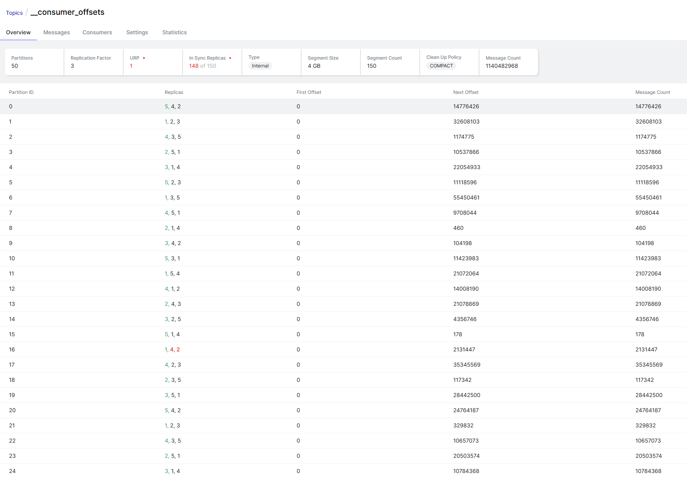

В продакшен кластере kafka 3.9.1 (Zookeeper + Kafka брокеры) в одной из партиций топика __consumer_offsets  под номером 16 две из трех реплик в рассинхроне




### Восстановление ISR для __consumer_offsets-16 (Kafka 3.9.1, ZooKeeper)
Что видно на скриншоте:
У партиции 16 реплики 1, 4, 2. Лидер брокер 1 (зелёный), а брокеры 4 и 2 выпали из ISR (красные). Отсюда URP = 1 и 148 of 150.


**Риски:** у партиции сейчас одна рабочая копия. Если брокер 1 упадёт, партиция станет offline, потому что unclean leader election по умолчанию выключен (включать его не нужно!). 
Если по каким-либо причинам брокер 1 станет оффлайн - все consumer group, у которых abs(group.id.hashCode()) % 50 == 16, потеряют координатор и не смогут коммитить и читать офсеты. Брокер 1 до окончания работ по восстановление реплик трогать нельзя.

### Диагностика

Подтвердить состояние и проверить насколько отстают реплики:

```bash
kafka-topics.sh --bootstrap-server b1:9092 --describe \
  --topic __consumer_offsets --under-replicated-partitions

kafka-log-dirs.sh --bootstrap-server b1:9092 --describe \
  --broker-list 1,2,4 --topic-list __consumer_offsets \
  | grep '^{' | jq '.brokers[] | {broker, dirs: [.logDirs[] | {logDir, error,
      p: [.partitions[] | select(.partition=="__consumer_offsets-16")]}]}'
```

Сравнить size и offsetLag на брокерах 2 и 4. Если лаг стоит на месте, репликация остановилась. Если медленно уменьшается, реплики догоняют лидера. Если в error что-то есть, у каталога лога проблема (скорее всего диск).

Посмотеть логи на брокерах 2 и 4:
```bash
grep "__consumer_offsets-16" /path/to/logs/server.log* \
  | grep -iE "error|warn|fail|corrupt|truncat|OutOfRange"
```

Ищем: ReplicaFetcherThread ... Error for partition, marked as failed, CorruptRecordException, InvalidRecordException, OffsetOutOfRange. На брокере 1 ищем Shrinking ISR, по времени станет понятно, когда всё началось.

Проверить JMX-метрику на брокерах 2 и 4: kafka.server:type=ReplicaFetcherManager,name=FailedPartitionsCount,clientId=Replica. Если она больше 0, fetcher исключил партицию из репликации. Сам он её обратно не возьмёт, пока не сменится лидер или брокер не перезапустится.

Проверить, не остались ли throttle после предидущего процесса переназначения реплик (частая и неочевидная причина):

```bash
kafka-configs.sh --bootstrap-server b1:9092 --describe \
  --entity-type topics --entity-name __consumer_offsets

for b in 1 2 4; do
  kafka-configs.sh --bootstrap-server b1:9092 --describe --entity-type brokers --entity-name $b
done
```

### Исправление в зависимости от причины
**1.** Если найдены throttle
Необходимо их удалить:
```bash
kafka-configs.sh --bootstrap-server b1:9092 --alter --entity-type topics \
  --entity-name __consumer_offsets \
  --delete-config leader.replication.throttled.replicas,follower.replication.throttled.replicas

kafka-configs.sh --bootstrap-server b1:9092 --alter --entity-type brokers \
  --entity-name 1 --delete-config leader.replication.throttled.rate,follower.replication.throttled.rate
# повторить для брокеров 2 и 4
```
Реплики должны догнать лидера за минуты: в партиции около 2 млн записей, это немного

**2.** fetcher отвалился (во время диагностики были найдены marked as failed, FailedPartitionsCount > 0), данные не повреждены

Перезапустить по очереди брокер 4, затем брокер 2 штатным controlled shutdown. Перед каждой остановкой необходимо убедиться, что вывод `kafka-topics.sh --describe --under-min-isr-partitions` пуст. Сама партиция 16 от остановки 2 или 4 не пострадает, они и так не в ISR. После старта брокера дождаться, пока он вернётся в ISR, и только потом переходить к следующему.

**3:** повреждение сегмента на фолловерах (Corrupt..., ошибки чтения или truncation)

Есть два способа:
**3.1** Онлайн через переназначение, без рестартов. Этот способ предпочтительнее: Kafka сама создаст чистые копии на других брокерах и удалит старые, возможно битые.
```bash
cat > move16.json <<'EOF'
{"version":1,"partitions":[{"topic":"__consumer_offsets","partition":16,"replicas":[1,3,5]}]}
EOF

kafka-reassign-partitions.sh --bootstrap-server b1:9092 \
  --reassignment-json-file move16.json --execute

kafka-reassign-partitions.sh --bootstrap-server b1:9092 \
  --reassignment-json-file move16.json --verify
```

**Важно!** Брокер 1 нужно оставить первым в списке, чтобы лидер не менялся. Когда --verify покажет, что переназначение завершено, при желании можно вернуть исходную раскладку [1,4,2] тем же способом. Делать после того, как будет понимание, почему копии на 2 и 4 сломались. --verify заодно снимает throttle, если они были заданы ранее через --throttle (или в рамках других работ).

**3.2** Пересоздание реплики вручную, с остановками брокеров. Делается по одному брокеру: сначала 4, потом 2.
Штатно остановить брокер.
Перенести каталог <log.dirs>/__consumer_offsets-16 за пределы log.dirs, не удаляя его сразу, на случай если понадобится разбор.
Запустите брокер. Он скопирует партицию у лидера с нуля.
Дождаться, пока брокер появится в ISR, и  только тогда переходить ко второму.

**4:** реплики живы, но отстают (лаг уменьшается, ошибок нет)
Смотреть нужно на сеть и диск брокеров 2 и 4 (iostat, заполненность диска), GC-паузы и replica.lag.time.max.ms (по умолчанию 30 с). Для одной партиции такое бывает редко, поэтому этот вариант маловероятен, сначала нужно попробовать 1-3

### Проверка после исправления
```bash
kafka-topics.sh --bootstrap-server b1:9092 --describe \
  --topic __consumer_offsets --under-replicated-partitions   # вывод должен быть пустым
```
Лидер уже стоит на предпочтительной реплике (брокер 1), так что перевыборы лидера запускать не нужно.

строка лога с брокера 4
```bash
/kafka/kafka/logs/server.log.6:[2026-09-13 20:57:52,636] ERROR [ReplicaFetcher replicaId=4, leaderId=1, fetcherId=0] Error for partition __consumer_offsets-16 at offset 2063764 (kafka.server.ReplicaFetcherThread) в логах на брокере 4
```

Разбор ошибки на брокере 4
Что означает эта строка

Сообщение Error for partition ... at offset ... в ReplicaFetcherThread появляется, когда лидер (брокер 1) вернул фолловеру код ошибки на fetch-запрос по этой партиции. Если бы фолловер сам нашёл проблему в полученных данных, текст был бы другим: Found invalid messages during fetch. Партиция при этом не помечается как failed. Фолловер ждёт replica.fetch.backoff.ms, запрашивает тот же offset 2063764 и снова получает ошибку. Реплика застревает на месте, а лидер уже ушёл до ~2131447.

Главное из этого: проблема, скорее всего, на стороне лидера, при чтении его лога в районе offset 2063764. Если брокер 2 стоит на том же offset, это почти наверняка так. Тогда варианты B и C из моего прошлого ответа не помогут и навредят:

Переназначение на другие брокеры не сработает, потому что новые реплики упрутся в тот же offset.
Удаление каталога партиции на 2 или 4 уничтожит единственные копии первых ~2 млн записей вне брокера 1.
Рестарт брокера 1 переведёт партицию в offline, а при старте координатор может не загрузить группы из повреждённого лога.

Тип ошибки записан в следующей строке после ERROR (стектрейс). От него зависит, как чинить.

Шаг 1. Собрать недостающее

Стектрейс и повторяемость на брокере 4:

```bash
grep -h -A6 "Error for partition __consumer_offsets-16" /kafka/kafka/logs/server.log* | head -20
# последнее вхождение: повторяется ли до сих пор и на том же ли offset
grep -h "Error for partition __consumer_offsets-16" /kafka/kafka/logs/server.log* | tail -3
```
То же на брокере 2. Если там тот же offset 2063764, причина точно на лидере.

Причина на лидере (брокер 1). Лидер пишет у себя реальное исключение:

bash
grep -h -A10 "Error processing fetch.*__consumer_offsets-16" /kafka/kafka/logs/server.log* | head -30
grep -h -A5 "__consumer_offsets-16" /kafka/kafka/logs/log-cleaner.log* | grep -iE "error|exception|uncleanable" | tail

Проверка сегмента на брокере 1. Это только чтение, лидер продолжает работать:

```bash
DIR=/путь/из/log.dirs/__consumer_offsets-16
SEG=$(ls $DIR/*.log | awk -F/ '{f=$NF; sub(/\.log$/,"",f); if (f+0 <= 2063764) s=$0} END{print s}')
echo $SEG

# батч, содержащий 2063764, и любые исключения
kafka-dump-log.sh --files $SEG 2>&1 | awk '
  /baseOffset:/ {for(i=1;i<=NF;i++){if($i=="baseOffset:")b=$(i+1); if($i=="lastOffset:")l=$(i+1)}
                 if (b+0<=2063764 && l+0>=2063764) print}
  /Exception|invalid bytes|isvalid: false/ {print}'
kafka-dump-log.sh --files $SEG 2>&1 | tail -3
```
# проверка индекса
`kafka-dump-log.sh --files ${SEG%.log}.index --index-sanity-check`

Параллельно посмотрите dmesg -T | grep -iE "i/o error|nvme|sd[a-z]" на брокере 1.

Шаг 2. Сделать прямо сейчас: бэкап офсетов групп партиции 16

Координатор на брокере 1 держит офсеты групп в памяти, и сейчас они корректны, даже если лог повреждён. Если починка потребует обрезать лог на лидере, коммиты после 2063764 пропадут, и группы откатятся назад. Сохраните офсеты заранее:

bash
kafka-consumer-groups.sh --bootstrap-server b1:9092 --list > groups.txt

# группы, чей координатор — партиция 16: Utils.abs(groupId.hashCode) % 50
```bash
python3 - > groups16.txt <<'EOF'
def jhash(s):
    b = s.encode('utf-16-be'); h = 0
    for i in range(0, len(b), 2):
        h = (31*h + int.from_bytes(b[i:i+2], 'big')) & 0xFFFFFFFF
    return h
for line in open('groups.txt'):
    g = line.rstrip('\n')
    if g and (jhash(g) & 0x7FFFFFFF) % 50 == 16:
        print(g)
EOF
```
BK=offsets_backup_$(date +%F_%H%M); mkdir -p $BK
while read -r g; do
  kafka-consumer-groups.sh --bootstrap-server b1:9092 --describe --group "$g" --offsets 2>/dev/null \
    | awk 'NF>=4 && $4 ~ /^[0-9]+$/ {print $2","$3","$4}' > "$BK/$g.csv"
done < groups16.txt

CSV получается в формате topic,partition,offset, его понимает kafka-consumer-groups.sh --reset-offsets --from-file. Повторите бэкап непосредственно перед любыми работами на брокере 1.

Шаг 3. Дальнейшие действия по результату

Повреждены данные на лидере. Например, CorruptRecordException, Record size 0 is less than the minimum record overhead, либо dump-log падает или показывает isvalid: false рядом с 2063764. В этом случае лог брокера 1 нужно обрезать до последнего валидного батча, после чего фолловеры догонят. Это делается в окно работ с кратким простоем партиции 16. После этого офсеты затронутых групп восстанавливаются из бэкапа при остановленных консьюмерах.

Данные целы, битый индекс (--index-sanity-check падает). Индекс на брокере 1 пересобирается: остановка, удаление .index/.timeindex этого сегмента, запуск. Данные при этом не теряются, простой партиции короткий.

KafkaStorageException или I/O ошибки в dmesg. Проблема в диске брокера 1. Нужно заранее решить, куда переносить лидерство, и начинать с железа.

Пришлите стектрейс после строки ERROR (с брокера 4 и, если есть, с брокера 1) и результат kafka-dump-log. По ним распишу точную процедуру для вашего случая.


Это не причина, а последствие, и оно уже влияет на работу

Эта строка меняет картину. В прошлый раз я назвал ситуацию риском на случай падения брокера 1. На деле сбой уже идёт:

Для __consumer_offsets действует min.insync.replicas=2, а в ISR партиции 16 остался только брокер 1.
Координатор пишет в эту партицию с acks=all, поэтому каждый коммит офсетов и каждый SyncGroup для групп партиции 16 отклоняется с NotEnoughReplicasException.
Клиент получает COORDINATOR_NOT_AVAILABLE, группа уходит в новый ребаланс, и это повторяется бесконечно. Сейчас в таком цикле UserAuditJournal.Prod: консьюмеры не получают назначение партиций и не коммитят. Остальные группы с координатором на партиции 16 в том же положении.
Шаг 1. Восстановить работу групп прямо сейчас

Посмотрите, откуда взялось значение 2: из конфига топика или из дефолта брокера.

```bash
kafka-configs.sh --bootstrap-server b1:9092 --describe --all \
  --entity-type topics --entity-name __consumer_offsets | grep min.insync
```
Временно снизьте min.insync.replicas до 1 на уровне топика. Это динамическая настройка, рестарт не нужен:

```bash
kafka-configs.sh --bootstrap-server b1:9092 --alter \
  --entity-type topics --entity-name __consumer_offsets \
  --add-config min.insync.replicas=1
```

Цена решения. Пока настройка действует, новые коммиты партиции 16 хранятся в одной копии. Если диск брокера 1 будет потерян, они пропадут. Но выбор сейчас не между надёжностью и риском, а между риском и уже идущим простоем: единственная копия и так одна, а без этой меры группы стоят. Изменение применится ко всем 50 партициям, однако остальные 49 с полным ISR это никак не затронет.

Проверьте, что группы стабилизировались. На брокере 1 должны пойти Stabilized group UserAuditJournal.Prod, а ошибки NotEnoughReplicasException должны прекратиться:

```bash
tail -f /kafka/kafka/logs/server.log | grep -E "__consumer_offsets-16|UserAuditJournal.Prod"
kafka-consumer-groups.sh --bootstrap-server b1:9092 --describe --group UserAuditJournal.Prod --state
```
После этого сделайте бэкап офсетов из прошлого ответа (шаг 2). Он по-прежнему нужен до любых работ с логом брокера 1.

Когда ISR восстановится, верните настройку:

```bash
kafka-configs.sh --bootstrap-server b1:9092 --alter \
  --entity-type topics --entity-name __consumer_offsets \
  --delete-config min.insync.replicas
```

Если значение 2 было задано именно на топике, а не на брокере, вместо удаления снова выставьте --add-config min.insync.replicas=2.

Шаг 2. Найти настоящую причину

В присланной строке с брокера 4 нет самого исключения. Оно печатается на следующей строке после ERROR.

Брокер 4: тип ошибки и повторяется ли она до сих пор

```bash
grep -h -A3 "Error for partition __consumer_offsets-16" /kafka/kafka/logs/server.log* | head -8
grep -h "Error for partition __consumer_offsets-16" /kafka/kafka/logs/server.log* | tail -2
```

Брокер 1: хронология выпадения реплик. В этих строках видны endOffset каждого фолловера и время выпадения:

```bash
grep -h "Shrinking ISR" /kafka/kafka/logs/server.log* | grep "__consumer_offsets-16"
```

Судя по данным, реплики выпали в разное время: брокер 4 застрял на 2063764 ещё 13-го, а лог лидера после этого вырос до ~2131447. Значит, брокер 2 оставался в ISR дольше. Если он стоит заметно дальше брокера 4, это важно для восстановления: у него самая полная копия после лидера.

Брокер 1: ошибки при отдаче данных фолловерам

```bash
grep -h -A10 "Error processing fetch.*__consumer_offsets-16" /kafka/kafka/logs/server.log* | head -30
grep -h -iE "error|uncleanable|exception" /kafka/kafka/logs/log-cleaner.log* | grep -A5 "__consumer_offsets-16" | tail
```

Если по первой команде ничего не найдётся, лидер вернул «тихую» ошибку, которую сам не логирует (OffsetOutOfRange, FencedLeaderEpoch, KafkaStorageException и подобные). Тогда тип ошибки будет виден только в стектрейсе на брокере 4.

Брокер 2: та же проверка

```bash
grep -h -A3 "Error for partition __consumer_offsets-16" /kafka/kafka/logs/server.log* | tail -8
```
Замечание по группе

Generation 38379200 — огромное значение. Даже при ребалансе раз в секунду до него пришлось бы идти больше года. Скорее всего, UserAuditJournal.Prod постоянно ребалансировалась задолго до этого инцидента: частые рестарты, превышение max.poll.interval.ms, короткий session.timeout.ms на rdkafka-клиентах. Каждый ребаланс пишет метаданные группы как раз в партицию 16. К выпадению реплик это напрямую, скорее всего, не относится, но проверить стоит отдельно, когда закроете инцидент.

Пришлите стектрейс с брокера 4 и строки Shrinking ISR с брокера 1. По ним будет понятно, чинить ли лог лидера или достаточно пересоздать реплики.


Значение 2 задано в двух местах: на самом топике (DYNAMIC_TOPIC_CONFIG) и в server.properties брокеров (STATIC_BROKER_CONFIG). Настройка топика приоритетнее брокерской, поэтому достаточно поменять её, server.properties трогать и перезапускать брокеры не нужно.

Снизить до 1
```bash
kafka-configs.sh --bootstrap-server $brokers --command-config $config --alter \
  --entity-type topics --entity-name __consumer_offsets \
  --add-config min.insync.replicas=1
```
Проверьте, что значение применилось. Первым в synonyms должно стоять DYNAMIC_TOPIC_CONFIG:min.insync.replicas=1:

```bash
kafka-configs.sh --bootstrap-server $brokers --command-config $config --describe --all \
  --entity-type topics --entity-name __consumer_offsets | grep min.insync
```

Брокер подхватывает новое значение через несколько секунд. Убедитесь на брокере 1, что ошибки прекратились и группы стабилизировались:

```bash
# в текущем логе не должно появляться новых NotEnoughReplicasException по партиции 16
tail -f /kafka/kafka/logs/server.log | grep -E "__consumer_offsets-16|UserAuditJournal.Prod"

kafka-consumer-groups.sh --bootstrap-server $brokers --command-config $config \
  --describe --group UserAuditJournal.Prod --state
# ожидаемо: STATE = Stable
```
Вернуть после восстановления ISR

Раньше значение было явно задано на топике, поэтому возвращайте его так же явно, а не удалением:

```bash
kafka-configs.sh --bootstrap-server $brokers --command-config $config --alter \
  --entity-type topics --entity-name __consumer_offsets \
  --add-config min.insync.replicas=2
```
Делайте это только после того, как --describe --under-replicated-partitions по __consumer_offsets вернёт пустой вывод. Если вернуть раньше, группы снова уйдут в цикл ребалансов.

Дальше

Когда группы оживут, сделайте бэкап офсетов групп партиции 16 (из предыдущего ответа, не забудьте добавить --command-config $config) и пришлите два фрагмента.

Стектрейс ошибки с брокера 4 и проверка, повторяется ли она сейчас:

```bash
grep -h -A3 "Error for partition __consumer_offsets-16" /kafka/kafka/logs/server.log* | head -8
grep -h "Error for partition __consumer_offsets-16" /kafka/kafka/logs/server.log* | tail -2
```
Хронология выпадения реплик с брокера 1:

```bash
grep -h "Shrinking ISR" /kafka/kafka/logs/server.log* | grep "__consumer_offsets-16"
```
Сейчас важнее всего тип исключения из первой команды: от него зависит, чинить ли лог на лидере или достаточно пересоздать реплики на 2 и 4.


Причина найдена: в сегменте на лидере записаны нули
Found record size 0 ... in file /kafka/data/kafka/__consumer_offsets-16/00000000000001539455.log

На брокере 1 в файле сегмента, в месте, где должен начинаться батч с offset 2063764, записаны нулевые байты. Это не битый индекс, а потерянные данные. Нули в файле обычно появляются, когда данные не дошли до диска: сбой ОС или виртуалки, потеря записи на уровне СХД или контроллера, проблема файловой системы.

Брокеры 2 и 4 оба застряли на fetchOffset=2063764. Значит, целой копии записей начиная с 2063764 нет ни на одном брокере. Эти записи придётся потерять, вопрос только в том, как сделать это без последствий для консьюмеров.

Есть и хорошие новости:

В хвосте лога больше нет NotEnoughReplicasException. После min.insync.replicas=1 коммиты проходят.
Всё время, пока ISR был 1 при min.isr=2, коммиты групп партиции 16 отклонялись, поэтому в логе после дыры почти нечего терять. При этом актуальные офсеты сейчас есть в памяти координатора на брокере 1: консьюмеры успели закоммитить свои реальные позиции после снижения min.isr. Их нужно сохранить и после починки восстановить. Сам файл спасать не нужно.

Не перезапускайте брокер 1 с этим файлом. Став лидером, он начнёт загружать группы из лога, упрётся в тот же участок, и группы партиции 16 могут остаться без офсетов. Консьюмеры тогда уйдут в auto.offset.reset.

План

Суть: переносим лидерство на брокер 4 (у него и у брокера 2 чистый лог до 2063763), восстанавливаем офсеты из бэкапа и пересоздаём реплику на брокере 1.

Подготовка (без простоя)

1. Список групп партиции 16

```bash
kafka-consumer-groups.sh --bootstrap-server $brokers --command-config $config --list > groups.txt

python3 - > groups16.txt <<'EOF'
def jhash(s):
    b = s.encode('utf-16-be'); h = 0
    for i in range(0, len(b), 2):
        h = (31*h + int.from_bytes(b[i:i+2], 'big')) & 0xFFFFFFFF
    return h
for line in open('groups.txt'):
    g = line.rstrip('\n')
    if g and (jhash(g) & 0x7FFFFFFF) % 50 == 16:
        print(g)
EOF
```

wc -l groups16.txt
grep -x "UserAuditJournal.Prod" groups16.txt   # проверка расчёта: группа обязана быть в списке

Выясните, каким приложениям принадлежат эти группы. На время работ их консьюмеры нужно будет остановить.

2. Предварительный бэкап офсетов (сделайте сразу)

```bash
backup_offsets() {
  BK=$1; mkdir -p "$BK"
  while read -r g; do
    kafka-consumer-groups.sh --bootstrap-server $brokers --command-config $config \
      --describe --group "$g" --offsets 2>"$BK/$g.err" \
      | awk 'NF>=4 && $4 ~ /^[0-9]+$/ {print $2","$3","$4}' > "$BK/$g.csv"
  done < groups16.txt
  echo "пустых csv: $(find "$BK" -name '*.csv' -empty | wc -l)"; cat "$BK"/*.err | sort -u | head
}
backup_offsets offsets_pre_$(date +%F_%H%M)
```
Пустой csv допустим, если у группы нет коммитов. Если в .err есть ошибки, с бэкапом разберитесь до начала работ.

3. Проверки перед остановкой брокера 1

```bash
kafka-topics.sh --bootstrap-server $brokers --command-config $config \
  --describe --under-replicated-partitions      # должна быть только __consumer_offsets-16
```
Дополнительно проверьте, что брокеры 2 и 4 действительно стоят на одном offset. В kafka-log-dirs у них должен быть одинаковый offsetLag.

4. Нет ли повреждений в других партициях брокера 1

```bash
grep -h "CorruptRecordException" /kafka/kafka/logs/server.log* | grep -o "in file [^ ]*" | sort | uniq -c
```
Если найдутся другие файлы, план придётся расширить. Напишите, что нашлось.

Окно работ

5. Остановите консьюмеры групп из groups16.txt.

6. Сделайте финальный бэкап. Группы теперь пустые, офсеты окончательные.

bash
backup_offsets offsets_final
kafka-consumer-groups.sh --bootstrap-server $brokers --command-config $config \
  --describe --group UserAuditJournal.Prod --state          # STATE = Empty

7. Штатно остановите брокер 1. Controlled shutdown не сможет передать лидерство партиции 16, сделает несколько попыток и завершится. Сообщения про неудачный controlled shutdown в логе в этом случае ожидаемы. Проверьте:

bash
kafka-topics.sh --bootstrap-server $brokers --command-config $config \
  --describe --topic __consumer_offsets | grep -P "Partition: 16\t"   # Leader: none

8. На брокере 1, пока он остановлен, перенесите каталог партиции за пределы log.dirs. Не удаляйте его, он пригодится для разбора причины.

```bash
mkdir -p /kafka/corrupt_backup
mv /kafka/data/kafka/__consumer_offsets-16 /kafka/corrupt_backup/
```
9. Выполните unclean election. Брокер 1 до этого момента не запускайте. Сейчас в ISR только он, и если он поднимется с пустым каталогом, то станет лидером с пустым логом, а фолловеры обрежут свои копии до нуля.

```bash
kafka-leader-election.sh --bootstrap-server $brokers --admin.config $config \
  --election-type unclean --topic __consumer_offsets --partition 16

kafka-topics.sh --bootstrap-server $brokers --command-config $config \
  --describe --topic __consumer_offsets | grep -P "Partition: 16\t"   # Leader: 4, в Isr нет 1
```
В логе брокера 4 проверьте строку Finished loading offsets and group metadata from __consumer_offsets-16 без ошибок рядом.

10. Только после этого запустите брокер 1. Он станет фолловером и скопирует партицию 16 с брокера 4 с нуля.

11. Восстановите офсеты. Сначала прогон без изменений:

```bash
while read -r g; do
  [ -s "offsets_final/$g.csv" ] || continue
  echo "== $g"
  kafka-consumer-groups.sh --bootstrap-server $brokers --command-config $config \
    --reset-offsets --group "$g" --from-file "offsets_final/$g.csv" --dry-run
done < groups16.txt
```

Если значения в колонке NEW-OFFSET совпадают с бэкапом, повторите ту же команду с --execute вместо --dry-run.

12. Запустите консьюмеры и убедитесь, что они продолжили с правильных позиций, без скачка лага:

```bash
kafka-consumer-groups.sh --bootstrap-server $brokers --command-config $config \
  --describe --group UserAuditJournal.Prod --offsets
```
Завершение

13. Дождитесь ISR 4,2,1 (или в другом порядке, но все три брокера) и пустого --under-replicated-partitions. После этого верните настройку:

```bash
kafka-configs.sh --bootstrap-server $brokers --command-config $config --alter \
  --entity-type topics --entity-name __consumer_offsets \
  --add-config min.insync.replicas=2
```
14. Лидерство партиции 16 рано или поздно вернётся на брокер 1: при auto.leader.rebalance.enable=true это произойдёт автоматически. Если причина на брокере 1 ещё не найдена, сначала переставьте реплики в порядке [4,2,1]. Переназначение с тем же набором брокеров выполняется мгновенно:

```bash
echo '{"version":1,"partitions":[{"topic":"__consumer_offsets","partition":16,"replicas":[4,2,1]}]}' > p16.json
kafka-reassign-partitions.sh --bootstrap-server $brokers --command-config $config \
  --reassignment-json-file p16.json --execute
```
Причина на брокере 1

Первая ошибка на брокере 4 была 13 сентября около 20:57, значит, повреждение появилось незадолго до этого. Проверьте на брокере 1:

```bash
journalctl --list-boots | tail -3; last -x | head       # не было ли перезагрузки/краша
journalctl -k --since "2026-09-13 18:00" --until "2026-09-13 22:00" | grep -iE "error|xfs|ext4|i/o|reset|timeout"
dmesg -T | grep -iE "i/o error|medium error|blk_update_request|xfs|ext4" | tail
```
Спросите у команды инфраструктуры, не было ли в это время миграции ВМ, снапшота или проблем на СХД. Пока диск брокера 1 под подозрением, лучше не делать его лидером новых партиций.

Если на каком-то шаге вывод не совпадёт с ожидаемым, особенно на 9 и 11, остановитесь и пришлите его сюда.


## План починки __consumer_offsets-16
Суть
**Что сломано.** На брокере 1 (лидер, единственный в ISR) в сегменте 00000000000001539455.log ФС потеряла около 8 МиБ данных. Байты 75497472…83945495 читаются как нули. Это offset'ы 2063764…2122407, запись 13.09 около 15:56:47.
**Что цело**  Всё до дыры есть на всех трёх брокерах. Всё после дыры (с 2122408 до конца) есть только на брокере 1.
**Как чиним.** Вырезаем дыру из файла и перезапускаем брокер 1 один раз. Для compacted-топика пропуск в offset'ах допустим. Брокер 1 остаётся лидером со всеми уцелевшими данными, фолловеры 2 и 4 догоняют его.
**Что теряем.** Только то, что уже потеряно: около 58,6 тыс. записей.
**Простой.** Партиция 16 недоступна, пока перезапускается брокер 1.
**Запасной вариант.** Unclean election на брокер 4 и восстановление офсетов из бэкапа.

Во всех командах используются $brokers и $config

**Этап 0.** Подготовка (без простоя, всё только на чтение)
**0.1.** Хранилище брокера 1

Если дыра появилась из-за нехватки места на thin-томе или ошибки хранилища, запись исправленного файла может сломаться так же. Поэтому сначала проверьте хранилище:

```bash
df -hT /kafka/data/kafka
lsblk -o NAME,TYPE,FSTYPE,SIZE,MOUNTPOINT
sudo lvs -a -o+data_percent,metadata_percent 2>/dev/null
journalctl -k --since "2026-09-13 15:55:30" --until "2026-09-13 15:58:00" --no-pager
journalctl -k --since "2026-09-12" --no-pager \
  | grep -iE "page discard|writeback|lost async page write|buffer i/o|no space|thin|xfs|ext4" | tail -30
```

Если нашлись ошибки writeback или заполненный thin pool, передайте это инфраструктуре и устраните до окна работ.

**0.2.** Поиск дыр во всех сегментах, на каждом брокере (1, 2, 4)
```bash
cat > /tmp/holes.py <<'EOF'
import os, sys
bad = 0
for p in (l.strip() for l in sys.stdin):
    if not p: continue
    try:
        fd = os.open(p, os.O_RDONLY)
        try:
            size = os.fstat(fd).st_size
            h = os.lseek(fd, 0, os.SEEK_HOLE)
            if h < size:
                try: d = os.lseek(fd, h, os.SEEK_DATA)
                except OSError: d = size
                bad += 1; print(f"HOLE {p}: {h}..{d} ({(d-h)/1048576:.2f} МиБ), size {size}")
        finally: os.close(fd)
    except OSError as e:
        print(f"ERR {p}: {e}")
print(f"файлов с дырами: {bad}", file=sys.stderr)
EOF

find /kafka/data/kafka -name '*.log' -size +0 | python3 /tmp/holes.py
```

Ожидаемый результат: на брокере 1 только __consumer_offsets-16/00000000000001539455.log, на брокерах 2 и 4 ни одного файла. Если нашлось что-то ещё, остановитесь и пришлите вывод.

**0.3.** Копии партиции 16 на брокерах 2 и 4 (нужны для отката)

Выполните на брокерах 2 и 4. Скрипт /tmp/scan_segments.py берётся из предыдущих ответов (версия со временем батча):

```bash
ls /kafka/data/kafka/__consumer_offsets-16/*.log | python3 /tmp/scan_segments.py   # «с проблемами 0»
kafka-dump-log.sh --files $(ls /kafka/data/kafka/__consumer_offsets-16/*.log | tail -1) 2>&1 \
  | grep baseOffset | tail -1                                                        # lastOffset 2063763
```
**0.4.** Список групп партиции 16
```bash
kafka-consumer-groups.sh --bootstrap-server $brokers --command-config $config --list > groups.txt

python3 - > groups16.txt <<'EOF'
def jhash(s):
    b = s.encode('utf-16-be'); h = 0
    for i in range(0, len(b), 2):
        h = (31*h + int.from_bytes(b[i:i+2], 'big')) & 0xFFFFFFFF
    return h
for line in open('groups.txt'):
    g = line.rstrip('\n')
    if g and (jhash(g) & 0x7FFFFFFF) % 50 == 16:
        print(g)
EOF

wc -l groups16.txt
grep -x "UserAuditJournal.Prod" groups16.txt     # должна быть в списке
```

Определите владельцев этих групп и договоритесь, что на время окна их консьюмеры будут остановлены.

**0.5.** Функция бэкапа офсетов и предварительный бэкап
```bash
backup_offsets() {
  BK=$1; mkdir -p "$BK"
  while read -r g; do
    kafka-consumer-groups.sh --bootstrap-server $brokers --command-config $config \
      --describe --group "$g" --offsets 2>"$BK/$g.err" \
      | awk 'NF>=4 && $4 ~ /^[0-9]+$/ {print $2","$3","$4}' > "$BK/$g.csv"
  done < groups16.txt
  echo "пустых csv: $(find "$BK" -name '*.csv' -empty | wc -l)"
  cat "$BK"/*.err | sort -u | head
}

backup_offsets offsets_pre_$(date +%F_%H%M)
```

Если в .err есть ошибки, разберитесь с ними до окна.

**0.6.** Исправленная копия сегмента и её проверка (брокер 1)

Рабочий каталог создавайте вне /kafka/data/kafka:

```bash
S=/kafka/data/kafka/__consumer_offsets-16/00000000000001539455.log
W=/kafka/repair_p16; mkdir -p $W

sha256sum $S | tee $W/orig.sha256              # отпечаток исходника, сверим в окне

head -c 75497472 $S >  $W/00000000000001539455.log
tail -c +83945497 $S >> $W/00000000000001539455.log
stat -c %s $W/00000000000001539455.log         # 96409440

echo $W/00000000000001539455.log | python3 /tmp/scan_segments.py      # «с проблемами 0»

kafka-dump-log.sh --files $W/00000000000001539455.log > $W/dump.txt 2>&1
grep -ciE "exception|isvalid: false" $W/dump.txt                       # 0
grep -E "baseOffset: (2063742|2122408) " $W/dump.txt                   # стык: 2063742 (lastOffset 2063763) → 2122408
tail -2 $W/dump.txt                                                    # lastOffset 2267629

ls -l /kafka/data/kafka/__consumer_offsets-16/                         # следующий сегмент: 00000000000002267630.log
cat /kafka/data/kafka/__consumer_offsets-16/leader-epoch-checkpoint
```
В leader-epoch-checkpoint ни одна эпоха не должна начинаться в диапазоне 2063764…2122407. CreateTime у батча 2122408 показывает, где заканчивается потерянный интервал.

**0.7.** Состояние кластера перед окном
```bash
kafka-topics.sh --bootstrap-server $brokers --command-config $config --describe --under-replicated-partitions
# должна быть только __consumer_offsets-16
kafka-topics.sh --bootstrap-server $brokers --command-config $config --describe --under-min-isr-partitions
# пусто (у __consumer_offsets сейчас min.isr=1)
```
Если в выводе есть другие партиции, рестарт брокера 1 может перевести их в offline или under-min-isr. Сначала разберитесь с ними.

**Этап 1.** Окно работ
Шаг 1. Остановить консьюмеров групп из groups16.txt
bash
kafka-consumer-groups.sh --bootstrap-server $brokers --command-config $config \
  --describe --group UserAuditJournal.Prod --state            # STATE = Empty

Проверьте так же несколько других групп из списка.

Шаг 2. Финальный бэкап офсетов
```bash
backup_offsets offsets_final
```
Шаг 3. Controlled shutdown брокера 1

Остановите брокер штатным способом, как обычно (systemd или скрипт). Лидерство остальных партиций перейдёт на брокеры 2 и 4. Партицию 16 передать некому, поэтому сообщения о неудачных попытках controlled shutdown в логе ожидаемы.

```bash
kafka-topics.sh --bootstrap-server $brokers --command-config $config \
  --describe --topic __consumer_offsets | grep -P "Partition: 16\t"        # Leader: none
pgrep -af kafka.Kafka                                                        # на брокере 1 пусто
```
Шаг 4. Резервная копия каталога партиции
```bash
mkdir -p /kafka/corrupt_backup
cp -a --sparse=always /kafka/data/kafka/__consumer_offsets-16 /kafka/corrupt_backup/
```
Шаг 5. Замена сегмента
```bash
D=/kafka/data/kafka/__consumer_offsets-16
W=/kafka/repair_p16

sha256sum -c $W/orig.sha256        # OK: исходник не менялся с момента подготовки
```
Если проверка не прошла, остановитесь и не продолжайте.

```bash
cp --sparse=never $W/00000000000001539455.log $D/00000000000001539455.log
chown kafka:kafka $D/00000000000001539455.log
rm -f $D/00000000000001539455.index $D/00000000000001539455.timeindex $D/00000000000001539455.txnindex
sync

echo $D/00000000000001539455.log | python3 /tmp/scan_segments.py     # «с проблемами 0»
echo $D/00000000000001539455.log | python3 /tmp/holes.py              # «файлов с дырами: 0»
stat -c '%s %U' $D/00000000000001539455.log                           # 96409440 kafka
```
Индексы удаляем намеренно: без них Kafka при старте перепроверит этот сегмент и построит индексы заново.

Шаг 6. Запуск брокера 1

Критично: не выполняйте unclean election, пока брокер 1 остановлен. Лидером должен остаться брокер 1.

Запустите брокер и проверьте лог:

```bash
grep "__consumer_offsets-16" /kafka/kafka/logs/server.log \
  | grep -iE "index|recover|truncat|corrupt|error|Finished loading"
```
Ожидаемо:

сообщение о том, что индекс для сегмента 1539455 не найден и сегмент восстанавливается;
Finished loading offsets and group metadata from __consumer_offsets-16.

Недопустимо: Truncating, CorruptRecordException, ошибки загрузки групп. Если они есть, переходите к откату.

Шаг 7. Лидер и репликация
```bash
kafka-topics.sh --bootstrap-server $brokers --command-config $config \
  --describe --topic __consumer_offsets | grep -P "Partition: 16\t"
# сразу: Leader: 1; через минуты: Isr: 1,4,2 (в любом порядке)
```
На брокерах 2 и 4 новых ошибок быть не должно:

```bash
tail -f /kafka/kafka/logs/server.log | grep "__consumer_offsets-16"
```
Отставание должно сокращаться до нуля:

```bash
kafka-log-dirs.sh --bootstrap-server $brokers --command-config $config --describe \
  --broker-list 1,2,4 --topic-list __consumer_offsets \
  | grep '^{' | jq -c '.brokers[] | {broker, p: [.logDirs[].partitions[] | select(.partition=="__consumer_offsets-16") | {size, offsetLag}]}'
```
Шаг 8. Сверка офсетов групп с финальным бэкапом
```bash
backup_offsets offsets_after

while read -r g; do
  if ! diff -q <(sort "offsets_final/$g.csv") <(sort "offsets_after/$g.csv") >/dev/null; then
    echo "== РАСХОЖДЕНИЕ: $g"; diff <(sort "offsets_final/$g.csv") <(sort "offsets_after/$g.csv") | head
  fi
done < groups16.txt
```
Если расхождений нет, переходите к шагу 9. Если есть, восстановите офсеты только у этих групп: сначала прогон без изменений, после проверки то же с --execute.

```bash
g="имя_группы"
kafka-consumer-groups.sh --bootstrap-server $brokers --command-config $config \
  --reset-offsets --group "$g" --from-file "offsets_final/$g.csv" --dry-run
```
Шаг 9. Запуск консьюмеров
```bash
kafka-consumer-groups.sh --bootstrap-server $brokers --command-config $config \
  --describe --group UserAuditJournal.Prod --offsets
```
Выполните дважды с интервалом: CURRENT-OFFSET должен расти, скачков лага быть не должно.

Этап 2. Завершение
Шаг 10. Вернуть min.insync.replicas=2

Только после того, как ISR партиции 16 содержит все три брокера и под-реплицированных партиций нет:

```bash
kafka-topics.sh --bootstrap-server $brokers --command-config $config \
  --describe --topic __consumer_offsets --under-replicated-partitions      # пусто

kafka-configs.sh --bootstrap-server $brokers --command-config $config --alter \
  --entity-type topics --entity-name __consumer_offsets \
  --add-config min.insync.replicas=2
```
Шаг 11. Убрать лидерство партиции 16 с брокера 1, пока причина не найдена
```bash
echo '{"version":1,"partitions":[{"topic":"__consumer_offsets","partition":16,"replicas":[4,2,1]}]}' > p16.json
kafka-reassign-partitions.sh --bootstrap-server $brokers --command-config $config \
  --reassignment-json-file p16.json --execute
kafka-reassign-partitions.sh --bootstrap-server $brokers --command-config $config \
  --reassignment-json-file p16.json --verify
kafka-leader-election.sh --bootstrap-server $brokers --admin.config $config \
  --election-type preferred --topic __consumer_offsets --partition 16
```
Координатор групп переедет на брокер 4. Клиенты сделают один короткий ребаланс.

Шаг 12. Контроль в течение суток

Log cleaner после рестарта снова возьмёт партицию 16 и начнёт её компактировать:

```bash
grep -hiE "uncleanable|corrupt|error" /kafka/kafka/logs/log-cleaner.log | tail
```
Также проверьте:

метрика uncleanable-partitions-count равна 0;
новые дыры не появились: holes.py на брокере 1 раз в сутки, пока инфраструктура не найдёт причину.
Шаг 13. Уборка

Через неделю стабильной работы удалите /kafka/corrupt_backup и /kafka/repair_p16. Порядок реплик [1,4,2] верните, когда причина на хранилище брокера 1 будет устранена.

Откат (если на шаге 6 или 7 что-то пошло не так)
Остановите брокер 1.
Уберите каталог партиции за пределы log.dirs:
```bash
   mv /kafka/data/kafka/__consumer_offsets-16 /kafka/corrupt_backup/p16_after_repair
```
Пока брокер 1 остановлен, выполните unclean election. Лидером станет брокер 4, первый живой в списке 1,4,2:
```bash
   kafka-leader-election.sh --bootstrap-server $brokers --admin.config $config \
     --election-type unclean --topic __consumer_offsets --partition 16
   kafka-topics.sh --bootstrap-server $brokers --command-config $config \
     --describe --topic __consumer_offsets | grep -P "Partition: 16\t"     # Leader: 4
```
Если запустить брокер 1 с пустым каталогом до этого шага, он станет лидером с пустым логом.
4. Запустите брокер 1. Он скопирует партицию с брокера 4.
5. Восстановите офсеты всех групп из offsets_final (dry-run, затем --execute), как в шаге 8, но для каждой группы из groups16.txt.
6. Запустите консьюмеров, затем выполните шаги 10–13.

**Чего не делать**
Не перезапускать брокер 1 до окна работ. Отключите для него автоперезагрузки и обновления.
Не удалять каталоги партиции 16 на брокерах 2 и 4: это копии для отката.
Не включать unclean.leader.election.enable глобально. Точечный kafka-leader-election --election-type unclean нужен только при откате.
Не возвращать min.insync.replicas=2, пока ISR партиции 16 не полный.


брокер1 
syslog-14092026
```bash
Sep 13 15:56:50 1 kernel: EXT4-fs (sdc): Delayed block allocation failed for inode 109576911 at logical offset 18432 with max blocks 1 with error 117
Sep 13 15:56:50 1 kernel: EXT4-fs (sdc): This should not happen!! Data will be lost

Sep 13 15:56:50 1 sh[3114246]: [2026-09-13 15:56:50,768] ERROR [ReplicaManager broker=1] Error processing fetch with max size 1048576 from replica [2] on partition yqswEkTuQOSXTLMyJf8ntQ:__consumer_offsets-16: PartitionData(topicId=yqswEkTuQOSXTLMyJf8ntQ, fetchOffset=2063764, logStartOffset=0, maxBytes=1048576, currentLeaderEpoch=Optional[91], lastFetchedEpoch=Optional[91]) (kafka.server.ReplicaManager)
Sep 13 15:56:50 1 sh[3114246]: org.apache.kafka.common.errors.CorruptRecordException: Found record size 0 smaller than minimum record overhead (14) in file /kafka/data/kafka/__consumer_offsets-16/00000000000001539455.log.
Sep 13 15:56:50 1 sh[3114246]: [2026-09-13 15:56:50,769] ERROR [ReplicaManager broker=1] Error processing fetch with max size 1048576 from replica [4] on partition yqswEkTuQOSXTLMyJf8ntQ:__consumer_offsets-16: PartitionData(topicId=yqswEkTuQOSXTLMyJf8ntQ, fetchOffset=2063764, logStartOffset=0, maxBytes=1048576, currentLeaderEpoch=Optional[91], lastFetchedEpoch=Optional[91]) (kafka.server.ReplicaManager)
Sep 13 15:56:50 1 sh[3114246]: org.apache.kafka.common.errors.CorruptRecordException: Found record size 0 smaller than minimum record overhead (14) in file /kafka/data/kafka/__consumer_offsets-16/00000000000001539455.log.
Sep 13 15:56:50 1 systemd[1]: Starting Auditbeat Watchdog Service...
Sep 13 15:56:50 1 systemd[1]: auditbeat-watchdog.service: Succeeded.
Sep 13 15:56:50 1 systemd[1]: Started Auditbeat Watchdog Service.
Sep 13 15:56:50 1 systemd[1]: auditbeat-watchdog.service: Consumed 54ms CPU time.
Sep 13 15:56:51 1 sh[3114246]: [2026-09-13 15:56:51,779] ERROR [ReplicaManager broker=1] Error processing fetch with max size 1048576 from replica [4] on partition yqswEkTuQOSXTLMyJf8ntQ:__consumer_offsets-16: PartitionData(topicId=yqswEkTuQOSXTLMyJf8ntQ, fetchOffset=2063764, logStartOffset=0, maxBytes=1048576, currentLeaderEpoch=Optional[91], lastFetchedEpoch=Optional[91]) (kafka.server.ReplicaManager)
Sep 13 15:56:51 1 sh[3114246]: org.apache.kafka.common.errors.CorruptRecordException: Found record size 0 smaller than minimum record overhead (14) in file /kafka/data/kafka/__consumer_offsets-16/00000000000001539455.log.
Sep 13 15:56:51 1 sh[3114246]: [2026-09-13 15:56:51,849] ERROR [ReplicaManager broker=1] Error processing fetch with max size 1048576 from replica [2] on partition yqswEkTuQOSXTLMyJf8ntQ:__consumer_offsets-16: PartitionData(topicId=yqswEkTuQOSXTLMyJf8ntQ, fetchOffset=2063764, logStartOffset=0, maxBytes=1048576, currentLeaderEpoch=Optional[91], lastFetchedEpoch=Optional[91]) (kafka.server.ReplicaManager)
Sep 13 15:56:51 1 sh[3114246]: org.apache.kafka.common.errors.CorruptRecordException: Found record size 0 smaller than minimum record overhead (14) in file /kafka/data/kafka/__consumer_offsets-16/00000000000001539455.log
```
Причина найдена: повреждение метаданных ext4 на sdc
```bash
EXT4-fs (sdc): Delayed block allocation failed for inode 109576911
               at logical offset 18432 with max blocks 1 with error 117
EXT4-fs (sdc): This should not happen!! Data will be lost
```
Всё сходится до байта: логический блок 18432 × 4096 = 75497472, ровно начало дыры. Kafka выдала первую CorruptRecordException через доли секунды после этой строки ядра.

Ошибка 117 — это EUCLEAN, «structure needs cleaning». Здесь важно, чего в сообщении нет: это не ошибка ввода-вывода (EIO, 5) и не нехватка места (ENOSPC, 28). Диск и СХД отработали штатно. EUCLEAN означает, что сам ext4 при выделении блоков обнаружил несогласованность своих метаданных — обычно расхождение битмапа блоков с дескриптором группы или неверную контрольную сумму. Выделить блоки для грязных страниц ФС не смогла, страницы выбросила, о чём честно написала «Data will be lost».

Отсюда три следствия:

Файловая система на sdc повреждена, и повреждение никуда не делось. Kafka продолжает писать на неё третьи сутки. Эпизод 12.09 на брокере 2 (offset 1499375) — почти наверняка первое проявление той же проблемы.
Починки одного файла недостаточно. Нужен offline-e2fsck. Без него дыра может появиться снова в любом файле, в том числе в уже исправленном.
План меняется: e2fsck требует размонтировать log.dirs, то есть выполняется в том же окне, но до замены сегмента. Иначе fsck может задеть только что подложенный файл.
Шаг 0. Диагностика прямо сейчас (безопасно, брокер работает)

Счётчик ошибок ФС в суперблоке. Это главное: покажет, сколько раз и когда ошибки были, в том числе до 13.09.

```bash
sudo dumpe2fs -h /dev/sdc 2>/dev/null | grep -iE "state|error|mount count|check|created|features"
```
Обратите внимание на Filesystem state (ожидается clean with errors), FS Error count, First error time, First error function, First error inode #, Last error time.

Была ли ФС переведена в read-only и с какими опциями смонтирована

```bash
grep -E "sdc|/kafka" /proc/mounts /etc/fstab
```
Если стоит errors=continue или errors=remount-ro не сработал, брокер продолжал писать поверх повреждённой ФС.

Первопричинное сообщение ядра. Строка про delayed allocation — следствие. Настоящая ошибка (bitmap and bg descriptor inconsistent, checksum does not match, ext4_lookup: comm ...) обычно появляется раньше:

```bash
sudo zgrep -hiE "EXT4-fs (error|warning)|bg descriptor|bitmap|checksum|htree|inode" /var/log/syslog* \
  | grep -i sdc | sort -u | head -40
sudo zgrep -hi "EXT4" /var/log/syslog* | grep "Sep 12" | head -20
```
Тот ли это inode

```bash
stat -c '%i %n' /kafka/data/kafka/__consumer_offsets-16/00000000000001539455.log   # 109576911
sudo find /kafka/data/kafka -inum 109576911
```
Здоровье самого диска. Ожидаемо чистое (ошибка не про I/O), но исключить стоит:

```bash
sudo smartctl -a /dev/sdc | grep -iE "result|reallocated|pending|uncorrect|error count"
lsblk -o NAME,TYPE,SIZE,MODEL,ROTA /dev/sdc; df -hT /kafka/data/kafka
```
Если это виртуалка, спросите у инфраструктуры, не было ли 12–13 сентября снапшота, миграции, расширения диска или сбоя на СХД.

Где лежит рабочая копия исправленного файла. Она не должна быть на sdc, иначе fsck может её задеть:

```bash
df /kafka/repair_p16 /kafka/corrupt_backup 2>/dev/null
```
Если это тот же раздел, перенесите каталог на другой том или на другой хост.
